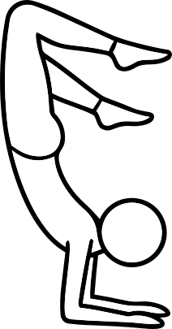
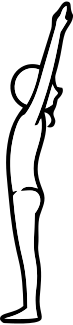
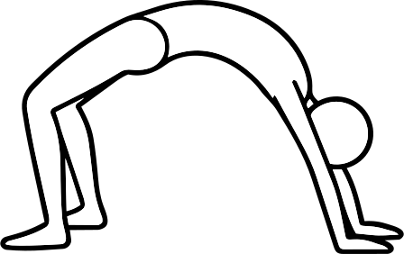

# Surya Namaskar

## Samasthiti/Tadasana

Samasthiti (Ashtanga), Tadasana (Iyengar). "Equal standing pose".
### Benefit
Strong backbend
### Alignment
Straight arms/legs, chest liftschest liftschest liftschest liftschest liftschest lifts
### Mistakes
Elbows flaring.
### Modifications
Bridge prep.

## Urdhva hastasana

Name
### Benefit
XXX
### Alignment
XXX
### Mistakes
XXX
### Modifications
XXX

## Uttanasana

_Full forward fold. "Intense stretching pose"._
### Benefit
XXX
### Alignment
XXX
### Mistakes
XXX
### Modifications
XXX

## Ardha uttanasana

Halfway lift
### Benefit
XXX
### Alignment
XXX
### Mistakes
XXX
### Modifications
XXX

## Plank

### Benefit
XXX
### Alignment
XXX
### Mistakes
XXX
### Modifications
XXX

## Chaturanga dandasana

XXX
### Benefit
XXX
### Alignment
XXX
### Mistakes
XXX
### Modifications
XXX

## Urdhva mukha svanasana

Upward facing dog
### Benefit
XXX
### Alignment
XXX
### Mistakes
XXX
### Modifications
XXX

## Adho mukha svanasana

Downward facing dog
### Benefit
XXX
### Alignment
XXX
### Mistakes
XXX
### Modifications
XXX

# Warriors & Lunges
## Virabhadrasana I

Name
### Benefit
XXX
### Alignment
XXX
### Mistakes
XXX
### Modifications
XXX

## Anjenyasana

Name
### Benefit
XXX
### Alignment
XXX
### Mistakes
XXX
### Modifications
XXX

High lunge
## Baddha virabhadrasana

Name
### Benefit
XXX
### Alignment
XXX
### Mistakes
XXX
### Modifications
XXX

## Virabhadrasana II

Name
### Benefit
XXX
### Alignment
XXX
### Mistakes
XXX
### Modifications
XXX

## Virabhadrasana III

Name
### Benefit
XXX
### Alignment
XXX
### Mistakes
XXX
### Modifications
XXX

# Standing / Balancing
## Ardha chandrasana

Half-moon
### Benefit
XXX
### Alignment
XXX
### Mistakes
XXX
### Modifications
XXX

## Parivrtta ardha chandrasana

Reverse half-moon
### Benefit
XXX
### Alignment
XXX
### Mistakes
XXX
### Modifications
XXX

## Chapasana

### Benefit
XXX
### Alignment
XXX
### Mistakes
XXX
### Modifications
XXX

## Parivrtta chapasana

Reverse chapasana
### Benefit
XXX
### Alignment
XXX
### Mistakes
XXX
### Modifications
XXX

## Natarajasana

Dancer
### Benefit
XXX
### Alignment
XXX
### Mistakes
XXX
### Modifications
XXX

## Utthita hasta padangustasana A
A Standing - B Side - C Folding over

Standing padangustasana
### Benefit
XXX
### Alignment
XXX
### Mistakes
XXX
### Modifications
XXX

## Utthita hasta padangustasana B
A Standing - B Side - C Folding over

Twisted padangustasana
### Benefit
XXX
### Alignment
XXX
### Mistakes
XXX
### Modifications
XXX

## Utthita hasta padangustasana B
Folding padangustasana
### Benefit
XXX
### Alignment
XXX
### Mistakes
XXX
### Modifications
XXX

## Udrhva prasarita ekapadasana
Standing split
### Benefit
XXX
### Alignment
XXX
### Mistakes
XXX
### Modifications
XXX

### xx

# Standing poses (hips & side body) 
## Utthita trikosana
### Benefit
Hamstring/side stretch ??????
### Alignment
Hinge at hip, spine long. WHAT DOES THE HIP DO
### Mistakes
Hyperextension ?? in knee? reaching too far?
### Modifications
Block under hand.

## Parivrtta trikonasana 
### Benefit
XXX detox twist?
### Alignment
Hips level, spine long. WHAT ABOUT HIP
### Mistakes
Rounding spine.
### Modifications
Block under hand.

## Utthita parsvakonasana — Extended Side Angle
### Benefit
Hip opening. THIGH WORKS?
### Alignment
Knee over ankle. Knee points forward. Long side body. Palm faces down. 
### Mistakes
Leaning forward. There should not be significant weight on lower hand. Fingers grazing the ground.
### Modifications
Forearm on thigh. Knee down.

## Parivrtta parsvakonasana — Revolved Side Angle
Twist over leg | Strength/digestion | Heel lifting | Block.
### Benefit
Strength/digestion? WHATS THE BENEFIT OF TWISTS?
### Alignment
XXX Should it be zahaknuty jako paka? Can be on tiptoes or rather foot W2? Should arms be open or closed?
### Mistakes
XXX
### Modifications
Blocks. Knee down. 

## Parsvottanasana — Pyramid
### Benefit
Hamstring stretch.
### Alignment
Hips level, fold, back straight CHEST OPEN?
### Mistakes
Hip misalignment.
### Modifications
Blocks under hands.

## Prasarita padottanasana A/B/C/D
A hands down, B hands on hips, C bind back, D grab toes | Hamstrings, calming | Weight in toes | Blocks/bent knees.

# SEATED POSES
## Paschimottanasana — Seated Forward Fold Kleste
### Benefit
Hamstring stretch.
### Alignment
Folding from hips.
### Mistakes
Rounding the spine.
### Modifications
Use strap or bend knees.

## Upavista konasana — Wide-Legged Forward Fold
Legs wide, spine long | Groin/hamstrings | Rounding spine | Sit on bolster.
## Ardha matsyendrasana — Seated Twist
Spine tall, twist ribs | Spinal mobility | Leaning back | Blanket.
## Janu sirsasana — Head-to-Knee Forward Fold
One leg extended, fold from hips with long spine | Hamstrings + side-body stretch |Collapsing chest, rounding spine, twisting torso toward bent knee | Strap around foot, bend extended knee

# HIP OPENERS & BACKBENDS
## Ekapada rajakapotasana — Pigeon Pose **??
Front shin forward, hips square | Hip/glute release | Dumping in low back | Bolster.
## Kapotasana — Full Pigeon Backbend **??
Knees hip-width | Deep chest opening | Low-back compression | Blocks.
## Ananda balasana — Happy Baby
Feet over knees, knees wide | Hip release | Pulling hard | Strap.
## Setu bandhasana — Bridge
Feet hip-width, lift pelvis | Back body strength | Knees splay | Block under sacrum.
## Dhanurasana — Bow Pose
Kick into hands | Quad/chest opening | Neck strain | Strap.

## Urdhva dhanurasana — Wheel

### Benefit
Strong backbend
### Alignment
Straight arms/legs, chest lifts
### Mistakes
Elbows flaring.
### Modifications
Bridge prep.

## Salabhasana — Locust
Lift chest + legs | Back strength | Overlifing head | Blanket.
ABC
## Ustrasana — Camel
Lift chest, hips forward | Heart opener | Low-back compression | Block between thighs.

# INVERSIONS + ARM BALANCES 
## BAKaSANA — Crow
Knees on triceps, gaze forward | Arm balance strength | Looking down | Block.
## PIÑCHA MAYŪRaSANA — Forearm Stand
Shoulders over elbows | Shoulder/core strength | Elbows splay | Strap.
## ADHO MUKHA VrKsaSANA — Handstand
Shoulders over wrists | Balance | Arching back | Wall.
## saLAMBA sĪRṢaSANA A/B — Supported Headstand
Forearms down, light on head | Strength + balance | Neck load | Wall/dolphin.
## Sirsasana — Headstand (Tripod or Supported) 
Strong shoulders, neutral neck | Focus | Banana back | Wall. HALaSANA — Plow
Legs overhead | Calming, spinal stretch | Neck pressure | Blankets.

# RESTORATIVE / NEUTRAL
## VĪRaSANA — Hero Pose
Sit between heels | Quad/ankle stretch | Knee pain | Block.
BALaSANA — Child’s Pose
Hips to heels, forehead down | Rest | Knee pressure | Bolster/wide knees.
sAVaSANA — Final Relaxation
Neutral spine, relaxed body | Nervous system reset | Fidgeting | Props as needed.

Marjaryasana / Bitilasana – Cat/Cow

Asana

Alignment | Benefits | Mistakes | Modifications

