# Surya Namaskar

## Samasthiti

_Samasthiti (Ashtanga), Tadasana (Iyengar). "Equal standing pose"._
### Benefit
Postural awareness, grounding, neutral alignment.
### Alignment
Feet rooted, legs active, pelvis neutral, ribs stacked over hips, crown lifts.
### Mistakes
Locking knees, flaring ribs, collapsing chest.
### Modifications
Slight knee bend, hands at heart.

## Urdhva Hastasana

_Upward Salute._
### Benefit
Shoulder flexion, length through side body.
### Alignment
Arms overhead, ribs contained, reach up without compressing lower back.
### Mistakes
Ribs flare, lumbar compression.
### Modifications
Arms shoulder-width, slight bend in elbows.

## Uttanasana
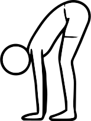

_Full forward fold. "Intense stretching pose"._
### Benefit
Hamstring stretch, posterior chain release.
### Alignment
Hinge from hips, spine long before folding.
### Mistakes
Rounding excessively. Disengaged legs.
### Modifications
Bend knees, hands on blocks. Don’t go so far down.

## Ardha Uttanasana
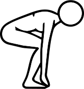

_Halfway Lift._
### Benefit
Spinal extension, prep for load-bearing in chaturanga.
### Alignment
Neutral spine, shoulders back, weight slightly forward.
### Mistakes
Rounded spine.
### Modifications
Hands on shins/thighs.

## High Plank

### Benefit
Core and shoulder stability.
### Alignment
Straight line, shoulders over wrists.
### Mistakes
Sagging hips.
### Modifications
Knees down.

## Chaturanga Dandasana
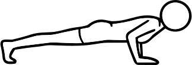

### Benefit
Upper body strength.
### Alignment
Elbows hug ribs, body in one line.
### Mistakes
Elbows flare, shoulders drop.
### Modifications
Knees down.

## Urdhva Mukha Svanasana
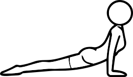

_Upward Dog._
### Benefit
Backbend, chest opening.
### Alignment
Press hands, lift thighs, chest forward.
### Mistakes
Shoulders by ears.
### Modifications
Cobra.

## Adho Mukha Svanasana
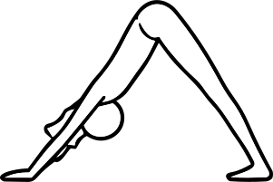

_Downward Dog._
### Benefit
Posterior chain length.
### Alignment
Hips up/back, spine long.
### Mistakes
Rounded back.
### Modifications
Bend knees.

## Utkatasana

_Chair. "Fierce Pose"._
### Benefit
Leg strength, ankle and hip loading, postural endurance.
### Alignment
Feet hip-width or together, sit hips back and down, knees track over toes, weight slightly into heels, ribs contained, arms reach overhead without flaring.
### Mistakes
Knees collapsing inward, weight too far in toes, over-arching lower back, chest dropping forward.
### Modifications
Hands at heart, reduce depth, place block between thighs for tracking.o

# Lunges

## Anjaneyasana
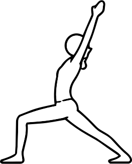

_High Lunge._
### Benefit
Hip flexor stretch.
### Alignment
Knee over ankle, hips forward.
### Mistakes
Low back compression.
### Modifications
Blocks.

## Virabhadrasana I
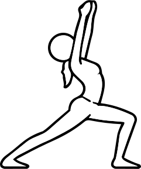

_Warrior I._
### Benefit
Hip flexor stretch and strength.
### Alignment
Hips square.
### Mistakes
Overarching.
### Modifications
Shorten stance.

## Virabhadrasana II
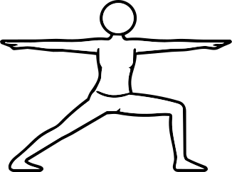

_Warrior II._
### Benefit
Leg strength, hip opening.
### Alignment
Knee tracks toes.
### Mistakes
Knee collapse.
### Modifications
Reduce depth.

## Baddha virabhadrasana

_Humble warrior. “Bound warrior”._
### Benefit
Hamstrings, shoulders, and hip opening.
### Alignment
Fold forward inside front leg, hips square, hands bound behind.
### Mistakes
Collapsing into front knee, rounding excessively.
### Modifications
Hands on hips or blocks.

## Utthita Parsvakonasana

_Extended side angle._
### Benefit
Side body stretch.
### Alignment
Long diagonal line. Knee over ankle. Knee points forward. Long side body. Palm faces down.
### Mistakes
Leaning forward. Too much weight on lower hand. Fingers grazing the ground.
### Modifications
Forearm on thigh. Knee down.

## Utthita Trikonasana

_(Extended) Triangle._
### Benefit
Hamstring and lateral stretch.
### Alignment
Hinge at hips, spine long, chest open. Front hip flexes while back hip stabilizes and slightly internally rotates.
### Mistakes
Collapsing chest. Hyperextending front knee. Reaching too far and losing structure.
### Modifications
Block.

## Parivrtta Trikonasana

_Revolved Triangle._
### Benefit
Twist, balance, digestion stimulation.
### Alignment
Hips level, spine long. Front hip draws back, back hip slightly forward to square pelvis.
### Mistakes
Rounding spine.
### Modifications
Block under hand.

## Parsvottanasana

_Pyramid._
### Benefit
Hamstrings.
### Alignment
Square hips. Back straight.
### Mistakes
Twisting. Hip misalignment.
### Modifications
Blocks.

## Parivrtta parsvakonasana

_Revolved Side Angle._
### Benefit
Strength, balance, and digestive stimulation through twisting.
### Alignment
Twist from torso. Front knee over ankle. Back heel can be lifted or grounded depending on stability. Arms can be in prayer or open.
### Mistakes
Heel lifting unintentionally, collapsing chest.
### Modifications
Blocks. Knee down.

# Balancing

## Virabhadrasana III
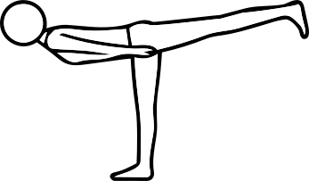

_Warrior III._
### Benefit
Balance, posterior chain strength.
### Alignment
Hips square, spine long.
### Mistakes
Opening hips, dropping chest.
### Modifications
Hands on blocks. Can look forward, opening the chest.

## Ardha Chandrasana
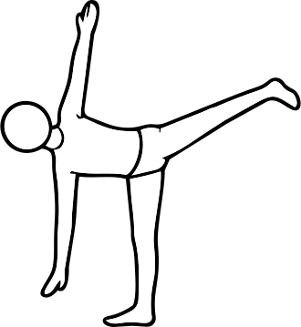

_Half-moon._
### Benefit
Balance and hip stability.
### Alignment
Stack hips.
### Mistakes
Dropping chest.
### Modifications
Block.

## Natarajasana
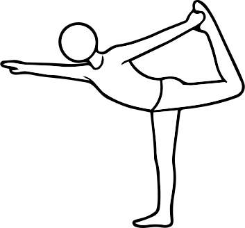

_Dancer._
### Benefit
Backbend balance.
### Alignment
Lift chest, kick back.
### Mistakes
Lumbar compression.
### Modifications
Strap.

## Chapasana
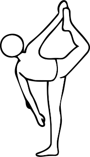

_Candycane._
### Benefit
Quad stretch and balance.
### Alignment
Open chest.
### Mistakes
Collapse.
### Modifications
Wall.

## Parivrtta Ardha Chandrasana
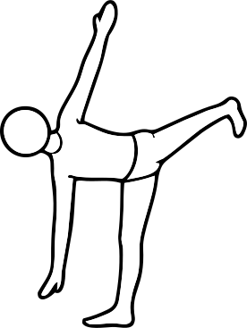

_Reverse half-moon._
### Benefit
Twist and balance.
### Alignment
Rotate torso.
### Mistakes
Instability.
### Modifications
Block.

## Parivrtta chapasana

_Reverse chapasana._
### Benefit
Twist, quad stretch, balance.
### Alignment
Maintain twist while holding foot, stabilize standing leg.
### Mistakes
Losing balance, over-rotating.
### Modifications
Strap or wall.

## Utthita Hasta Padangustasana A/B/C
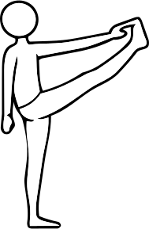

*Extended Hand-to-Big-Toe Pose.*

*A – Standing, B – Twisted, C – Folding over*
### Benefit
Hamstrings and balance.
### Alignment
Spine tall.
### Mistakes
Rounding.
### Modifications
Strap.

# Forward Folds

## Prasarita Padottanasana A/B/C/D

*”Wide Stance Forward Bend”*

*A – hands down, B – hands on hips, C – bind back, D – grab toes*
### Benefit
Inner legs.
### Alignment
Weight onto toes.
### Mistakes
Weight back.
### Modifications
Blocks. Bent knees.

## Urdhva Prasarita Eka Padasana

_Standing splits._
### Benefit
Hamstrings, balance.
### Alignment
Hips square, lifted leg active.
### Mistakes
Opening hips, collapsing torso.
### Modifications
Hands on blocks.

## Upavistha Konasana

_Wide-Legged Forward Fold_
### Benefit
Inner thighs.
### Alignment
Spine long, legs wide.
### Mistakes
Rounding.
### Modifications
Sit elevated.

## Paschimottanasana

_Seated Forward Fold, kleště_
### Benefit
Hamstrings.
### Alignment
Fold from hips.
### Mistakes
Collapsing chest, rounding spine.
### Modifications
Strap or knee bend.

## Janu Sirsasana

_Head-to-Knee Forward Fold_
### Benefit
Hamstrings + asymmetry work.
### Alignment
One leg extended, fold from hips with long spine. Chest opening upwards.
### Mistakes
Collapsing chest, rounding spine, twisting torso toward bent knee
### Modifications
Bend knee. Strap.
### Assist
Step next to hip, press ankle in, instruct to press their entire back into your thigh. Their other foot should be active.

# Arm Balances

## Bakasana

_Crow_
### Benefit
Arm strength.
### Alignment
Knees on triceps, gaze forward, lean forward.
### Mistakes
Looking down.
### Modifications
Feet stay on the ground. Feet on blocks.
### Taking it further
Drop to tripod headstand. From tripod headstand to chaturanga.

## Side Crow

Add more info here about that

## Tittibhasana

_Firefly_
### Benefit
Core and arm strength. Hamstring stretch.
### Alignment
Sit on triceps first. Extend legs. Squeeze knees together and rotate internally.
### Mistakes
Low hips. Arms too much under knees.
### Modifications
Bent legs.

# Inversions

## Salamba Sarvangasana

_Supported shoulderstand, candle_
### Benefit
Inversion, calming.
### Alignment
Weight in shoulders.
### Mistakes
Neck pressure.
### Modifications
Blankets.

## Halasana

_Plow_
### Benefit
Spinal stretch. Calming.
### Alignment
Legs overhead.
### Mistakes
Neck strain.
### Modifications
Support feet.

## Sirsasana

_Headstand: tripod or supported_
### Benefit
Balance. Focus.
### Alignment
Light head, strong shoulders.
### Mistakes
Dumping weight to neck. Banana back.
### Modifications
Wall.

## Pincha Mayurasana

_Peacock feather pose_
### Benefit
Shoulder and core strength.
### Alignment
Press forearms. Shoulders over elbows. Hips over head.
### Mistakes
Elbow splay. Rib flare.
### Modifications
Wall.
### Building towards it
Wall-facing L-stand. Visualisation.

## Adho Mukha Vrksasana

_Handstand. ”Downward facing tree”._
### Benefit
Full-body strength. Balance.
### Alignment
Stacked body.
### Mistakes
Banana back.
### Modifications
Wall.

# Backbends

## Setu Bandhasana

_Bridge_
### Benefit
Glutes + backbend. Back body strength.
### Alignment
Feet hip-width, lift pelvis. Press feet.
### Mistakes
Knees splay.
### Modifications
Block under sacrum for supported.
### Taking it further
Walk feet closer to head for a deeper bend.

## Salabhasana

_Locust_
### Benefit
Back strength.
### Alignment
Lift chest and legs.
### Mistakes
Neck strain: look slightly forward.
### Modifications
Blanket.

## Dhanurasana

_Bow_
### Benefit
Quad/chest opening.
### Alignment
Lying on the front. Kick into hands.
### Mistakes
Knees wide. Neck strain: look slightly forward.
### Modifications
Strap.

## Ustrasana

_Camel_
### Benefit
Heart opener.
### Alignment
Lift chest, hips forward
### Mistakes
Low-back compression. Think: reaching crown away from hips.
### Modifications
Block between thighs.

## Urdhva Dhanurasana

_Full wheel. ”Half bow”._
### Benefit
Full backbend.
### Alignment
Push evenly. Straight arms/legs, chest lifts.
### Mistakes
Elbows flare.
### Modifications
Bridge.

## Kapotasana

_Full Pigeon Backbend_
### Benefit
Deep chest opening.
### Alignment
Knees hip-width
### Mistakes
Low-back compression
### Modifications
Blocks.

# Hip Openers

## Ananda balasana

_Happy Baby_
### Benefit
Hip release
### Alignment
Feet over knees, knees wide. Keep sacrum down if possible.
### Mistakes
Pulling hard. 
### Modifications
Strap.

## Pigeon* 

Note on naming: [actual “kapotasana” “pigeon pose”](https://en.wikipedia.org/wiki/Kapotasana) is a back bend. Hip-opening pigeon is a simplified version of Ekapada rajakapotasana, which is the King pigeon.

## Mermaid*

_Eka Pada Rajakapotasana II, or Naginyasana, "Serpent Queen Pose”._
### Benefit
“Entry-level" king pigeon variation. Heavy on the quad stretch.
### Alignment
Back foot is hooked in the elbow crease; hands usually clasp.
### Mistakes
???
### Modifications
???

## Ekapada rajakapotasana

_One-legged king pigeon pose._
### Benefit
Deep spinal extension. Full-body hoop.
### Alignment
Overhead reach to grab the back foot with one or both hands. Keep lower back open.
### Mistakes
???
### Modifications
Strap.
### Assist
Loop strap around foot. Student grabs strap and reaches arms all the way up. Then starts walking hands down the strap. Optionally, they can keep pressing into teacher’s thigh with the back foot while pressing into teacher’s hand on their lower back, which creates space in the lower back.

# Twists

## Twists
What are the benefits of twists: Twists improve spinal mobility, aid digestion by compressing and releasing abdominal organs, and build control and balance.

# Neutral

## Virasana

_Hero Pose_
### Benefit
Quad/ankle stretch
### Alignment
Sit between heels
### Mistakes
Knee pain.
### Modifications
Sit on block.

## Balasana

_Child’s Pose_
### Benefit
Rest.
### Alignment
Hips to heels, forehead down.
### Mistakes
Knee pressure.
### Modifications
Bolster. Knees wide.

## Marjaryasana / Bitilasana

_Cat/Cow_
### Benefit
Spinal mobility.
### Alignment
Move between flexion and extension.
### Mistakes
Forcing range.
### Modifications
Slow movement.

## Savasana

### Benefit
Nervous system reset.
### Alignment
Neutral spine, relaxed body.
### Mistakes
Fidgeting.
### Modifications
Props.
### Assists
Rotate legs internally. Rotate biceps upward for shoulders/chest to open. Forearm stretch. Neck stretch. Adding props. Weighing palms down so they rotate outward.